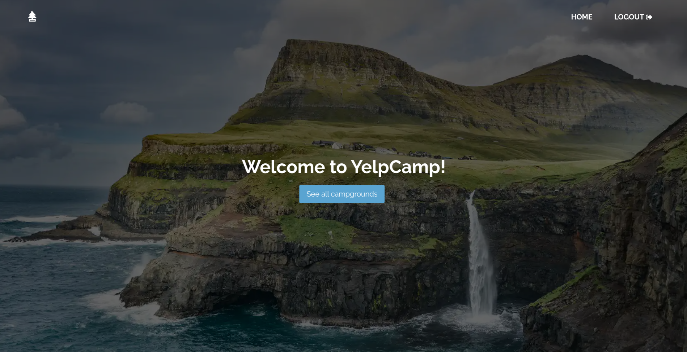
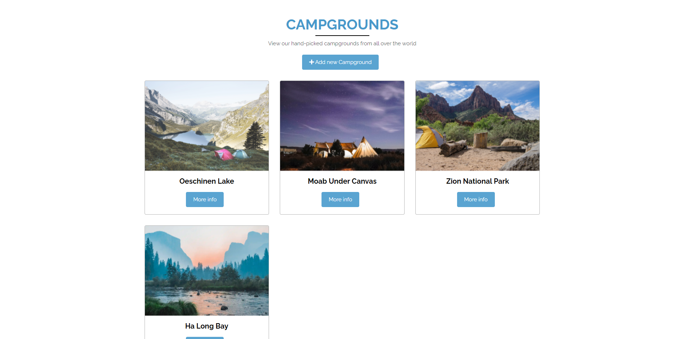
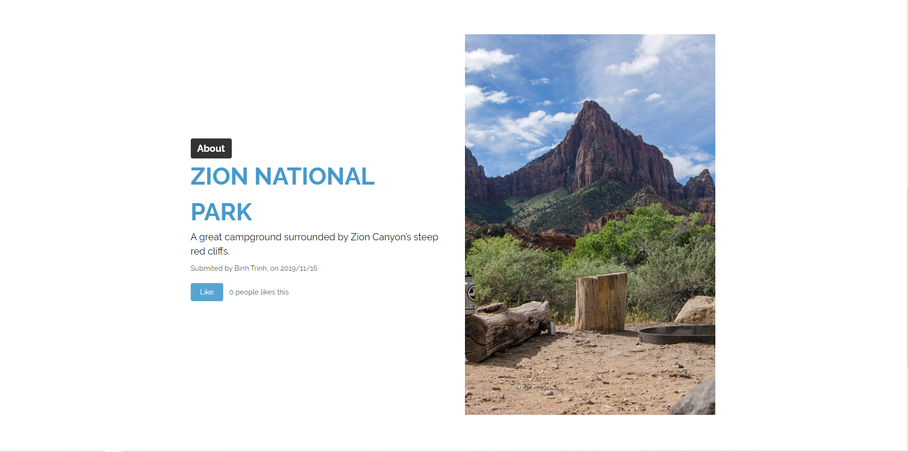

# YelpCamp

A MERN Stack Application that allows user to create, read, update, and delete campground information

## Project Screen Shot(s)

## Installation and Setup Instructions

Clone down this repository. You will need `node` and `npm` installed globally on your machine.

Installation:

`npm install`

To Start Server in Development mode:

`npm run server`

To develop the client, cwd into client:

`cd client`

Installation:

`npm install`

To Start Client in Development mode:

`npm run start`

To compile Sass to CSS:

`npm run sass`

## Features:

<ul>
<li>Authentication</li>
<ul>
<li> User registration </li>
<li> User login with email and password </li>
<li> Email collision feature </li>
</ul>
<li>Authorization:</li>
<ul>
<li> User cannot create new campground without being authenticated </li>
<li> Users cannot edit or delete campground created by another user </li>
</ul>
<li> Manage campground posts with basic functionalities: </li>
<ul>
<li>Create, edit and delete posts and comments</li>
<li>Upload campground photos</li>
<li>Browse through a list of campgrounds</li>
</ul>
<li>Responsive Web Design
</ul>

## Technologies:

### Front-end:

- React
- Redux
- SASS

### Back-end

- bcryptjs
- express
- jsonwebtoken
- mongoDB
- mongoose
- moment

## Reflection

After finishing with the <a href="https://www.udemy.com/course/the-web-developer-bootcamp/">all-time famous Web Development Course</a> by Colt Steele, and the <a href="https://www.udemy.com/course/mern-stack-front-to-back/">MERN Stack Front To Back: Full Stack React, Redux & Node.js</a> by my favorite online instructor Brad Traversy, I wanted to start building something that allowed me to practice my Web Development skills. That was when I tried to take the tech stacks from the later course to re-implement the big project on the first course, and Yelp Camp React was born. The application was a fusion of my two most favorite courses back then.

The most challenging aspect of this project was my unfamiliarity with Javascript higher-order functions(such as `.map()`, `.filter()`, etc.) back then. It was also my mistake that I tried to learn new technologies too fast, without looking back and review what I just learned. Instead, I kept consuming the knowledge passively without actively understanding the reasoning behind certain functionalities. It was not until I tried building a project that I finally realized my mistakes and later tried to understand the basics before moving on to more complicated materials.
